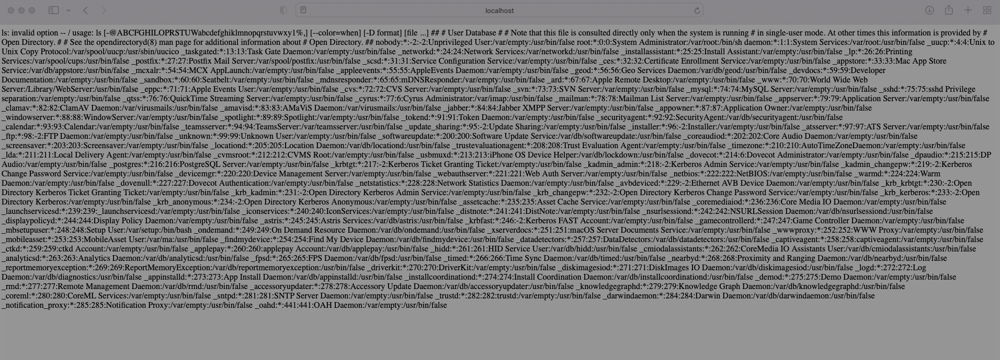
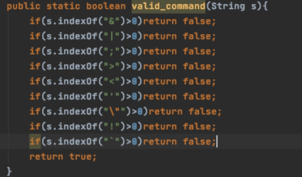

# 一、安全设计原则

## 1、基本原则

**1）攻击面最小化：**

尽量减少暴露恶意用户可能发现并试图利用的攻击面数量，如关闭没用的端口；

**2）基本隐私原则：**

确保用户隐私的安全性；

**3）权限最小化**

评估应用程序的行为及功能所需的最低限度权限及访问级别，从而合理分配相应的权限；

**4）默认安全**

默认配置确保应用程序初始化状态下处于较安全的状态；

**5）纵深防御**

不同安全方案之间需要相互配合，构成一个整体，在解决根本问题的地方实施针对性的安全方案；

**6）威胁建模**

识别潜在的安全问题并实施应援措施。

## 2、安全设计原则

1. **数据和代码分离原则：**要求禁止将数据、用户输入随意拼接到代码中；
2. **谨慎使用黑名单原则：**要求尽量使用白名单，减少使用黑名单，避免黑客绕过；
3. **业务隔离原则：**要求应用程序合理划分业务，进行业务隔离或网络隔离，将风险限制在一定的范围内；
4. **失效保护原则：**要求当出现故障时或系统异常时，可以进入到一个失败保护状态。如果用户请求失败，系统仍可保障安全。

# 二、安全编码规范

## 1、基本安全编码原则

| 原则               | 说明                                               | 相关漏洞                                       |
| ------------------ | -------------------------------------------------- | ---------------------------------------------- |
| 输入输出校验       | 一切用户可控输入都是不可信数据，必须进行检验和过滤 | SQL注入、命令注入、XSS、任意文件上传等         |
| 身份认证和访问控制 | 用户身份认证、授权和鉴权，防止越权漏洞             | 越权、未授权访问、权限提升、jwt弱密钥等        |
| 文件和资源管理     | 保护服务器文件系统和其他资源不被篡改和非法读取     | 任意文件上传/下载/覆盖等                       |
| 数据安全           | 涉及加密算法安全、信息存储安全等，保护数据机密性   | 日志打印敏感数据、弱密钥、敏感信息明文存储等。 |

## 2、SQL注入

SQL注入攻击是通过恶意的SQL查询或添加语句插入到应用的输入参数中，再在后台SQL服务器上解析执行进行的攻击，它是目前黑客对数据库进行攻击的最常用手段之一。

当应用程序将用户输入的内容，拼接到SQL语句中，一起提交给数据库执行时，用户的数据可能被认为是SQL语句的一部分，此时就产生SQL注入威胁。攻击者通过控制部分SQL语句，可以绕过身份验证、查询数据库中任何需要的数据，利用数据库的一些特性，甚至可以执行系统命令，直接获取数据库服务器的系统权限。

### 1）演示

### 2）根因

1、直接拼接用户输入到SQL语句中，没有检查用户输入；

2、用户输入过滤不彻底，SQL注入预防函数绕过；

3、构造SQL语句时，没有使用预编译或参数绑定；

### 3）加固方案

1、对用户输入进行过滤和校验，禁止用户输入中带有SQL注敏感字符；

2、敏感符号进行编译转译，例如使用`org.apache.commons.lang.StringEscapeUtils.escapeSql(s)`;

```xml
<dependency>
    <groupId>commons-lang</groupId>
    <artifactId>commons-lang</artifactId>
    <version>2.6</version>
</dependency>
```

3.使用参数化查询和预编译（如使用prepareStatement），并且正确使用预编译（使用？绑定用户输入的参数）；

4、无法预编译的位置进行严格内容限制。

## 3、命令注入

命令注入是指系统使用了可以执行命令的危险函数，但是调用这些函数的参数可控，并没有做过滤或过滤不严格，使攻击者可以通过函数构造特殊命令字符串的方式将数据提交至Web应用程序中，并利用该方式执行外部程序或命令实施攻击，来非法获取数据网络资源，获得受害主机的控制权。

命令注入漏洞可能出现在多个位置，如操作文件，发起网络请求等时，漏洞的本质在于特定的函数参数没有进行严格过滤。

### 1）案例


### 2）根因

1、滥用危险函数，例如删除文件时使用：

`runtime.exec("bin/bash","-c","rm",request.getParameter(file))`

2、特定函数的参数没有进行严格过滤

### 3）加固方案

1、使用其他函数代替具有执行系统命令的函数，减少危险函数的使用。比如删除文件时使用`file.delete`代替`ProcessBuild`、`Runtime`调用系统命令；

2、危险函数的参数必须经过严格过滤，对危险函数的参数中的敏感字符进行编码转译；



3、最小权限运行应用程序，避免使用root运行（最小权限原则和纵深防御原则）


​	


https://blog.csdn.net/weixin_45985053/article/details/125872921

https://blog.csdn.net/weixin_44604541/article/details/109597356?ops_request_misc=&request_id=&biz_id=102&utm_term=java%20xxe%E6%BC%8F%E6%B4%9E%E5%8E%9F%E7%90%86&utm_medium=distribute.pc_search_result.none-task-blog-2~all~sobaiduweb~default-3-109597356.142^v87^control,239^v2^insert_chatgpt&spm=1018.2226.3001.4187


```java
package me.gv7.xxe;

import java.io.IOException;
import java.io.PrintWriter;

import javax.servlet.ServletException;
import javax.servlet.annotation.WebServlet;
import javax.servlet.http.HttpServlet;
import javax.servlet.http.HttpServletRequest;
import javax.servlet.http.HttpServletResponse;
import org.w3c.dom.Document;
import org.w3c.dom.NodeList;
import org.xml.sax.SAXException;

import javax.xml.parsers.*;

@WebServlet("/doLoginServlet")
public class LoginServlet extends HttpServlet {
	private static final long serialVersionUID = 1L;
	
	private static final String USERNAME = "admin";//账号
	private static final String PASSWORD = "admin";//密码
	
	protected void doGet(HttpServletRequest request, HttpServletResponse response) throws ServletException, IOException {		
		DocumentBuilderFactory dbf = DocumentBuilderFactory.newInstance();     
        DocumentBuilder db;
        String result="";
		try {
			db = dbf.newDocumentBuilder();
			/*修复代码*/ 
			//dbf.setExpandEntityReferences(false);
			Document doc = db.parse(request.getInputStream());
			String username = getValueByTagName(doc,"username");
			String password = getValueByTagName(doc,"password");
			if(username.equals(USERNAME) && password.equals(PASSWORD)){
				result = String.format("<result><code>%d</code><msg>%s</msg></result>",1,username);
			}else{
				result = String.format("<result><code>%d</code><msg>%s</msg></result>",0,username);
			}
		} catch (ParserConfigurationException e) {
			e.printStackTrace();
			result = String.format("<result><code>%d</code><msg>%s</msg></result>",3,e.getMessage());
		} catch (SAXException e) {
			e.printStackTrace();
			result = String.format("<result><code>%d</code><msg>%s</msg></result>",3,e.getMessage());
		}
		response.setContentType("text/xml;charset=UTF-8");
		response.getWriter().append(result);
	}

	protected void doPost(HttpServletRequest request, HttpServletResponse response) throws ServletException, IOException {
		doGet(request, response);
	}

	/**
	 * 
	 * @param doc 文档
	 * @param tagName 标签名
 	 * @return 标签值
	 */
	public static String getValueByTagName(Document doc, String tagName){  
        if(doc == null || tagName.equals(null)){  
            return "";  
        }  
        NodeList pl = doc.getElementsByTagName(tagName);  
        if(pl != null && pl.getLength() > 0){  
            return pl.item(0).getTextContent();  
        } 
        return "";
    }
}

```

