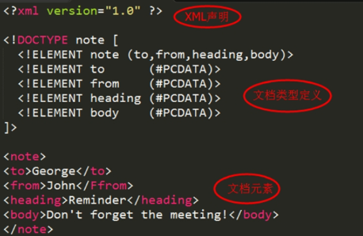
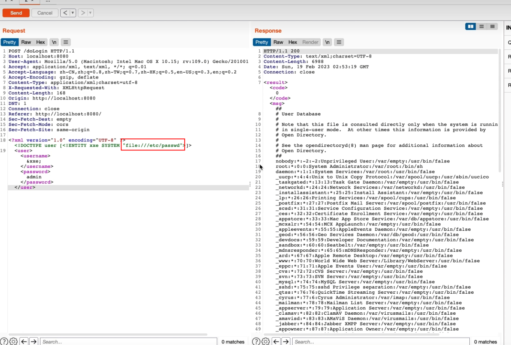
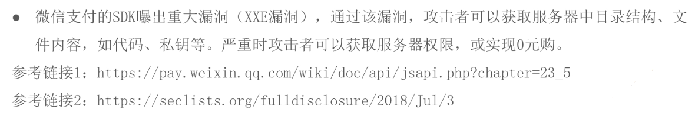
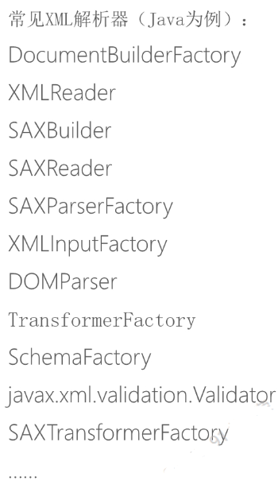
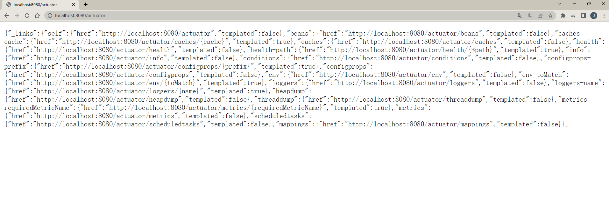
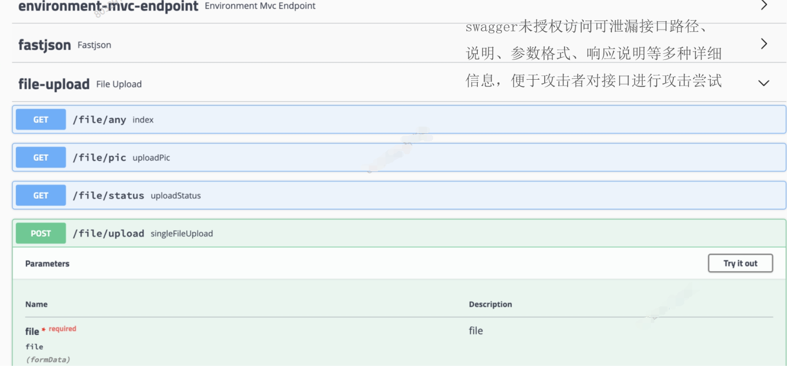
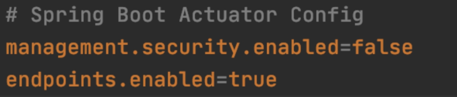
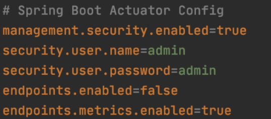
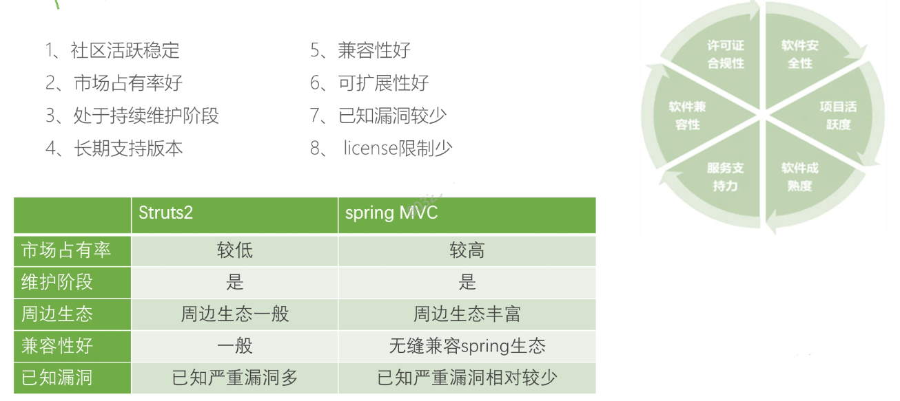
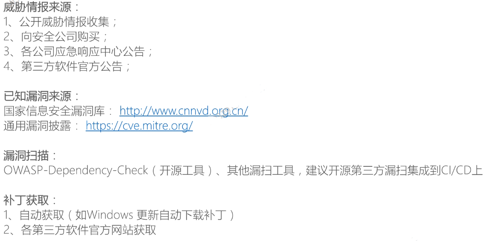

# 一、安全设计原则

## 1、基本原则

**1）攻击面最小化：**

尽量减少暴露恶意用户可能发现并试图利用的攻击面数量，如关闭没用的端口；

**2）基本隐私原则：**

确保用户隐私的安全性；

**3）权限最小化**

评估应用程序的行为及功能所需的最低限度权限及访问级别，从而合理分配相应的权限；

**4）默认安全**

默认配置确保应用程序初始化状态下处于较安全的状态；

**5）纵深防御**

不同安全方案之间需要相互配合，构成一个整体，在解决根本问题的地方实施针对性的安全方案；

**6）威胁建模**

识别潜在的安全问题并实施应援措施。

## 2、安全设计原则

1. **数据和代码分离原则：**要求禁止将数据、用户输入随意拼接到代码中；
2. **谨慎使用黑名单原则：**要求尽量使用白名单，减少使用黑名单，避免黑客绕过；
3. **业务隔离原则：**要求应用程序合理划分业务，进行业务隔离或网络隔离，将风险限制在一定的范围内；
4. **失效保护原则：**要求当出现故障时或系统异常时，可以进入到一个失败保护状态。如果用户请求失败，系统仍可保障安全。

# 二、安全编码规范

## 1、基本安全编码原则

| 原则               | 说明                                               | 相关漏洞                                       |
| ------------------ | -------------------------------------------------- | ---------------------------------------------- |
| 输入输出校验       | 一切用户可控输入都是不可信数据，必须进行检验和过滤 | SQL注入、命令注入、XSS、任意文件上传等         |
| 身份认证和访问控制 | 用户身份认证、授权和鉴权，防止越权漏洞             | 越权、未授权访问、权限提升、jwt弱密钥等        |
| 文件和资源管理     | 保护服务器文件系统和其他资源不被篡改和非法读取     | 任意文件上传/下载/覆盖等                       |
| 数据安全           | 涉及加密算法安全、信息存储安全等，保护数据机密性   | 日志打印敏感数据、弱密钥、敏感信息明文存储等。 |

## 2、SQL注入

SQL注入攻击是通过恶意的SQL查询或添加语句插入到应用的输入参数中，再在后台SQL服务器上解析执行进行的攻击，它是目前黑客对数据库进行攻击的最常用手段之一。

当应用程序将用户输入的内容，拼接到SQL语句中，一起提交给数据库执行时，用户的数据可能被认为是SQL语句的一部分，此时就产生SQL注入威胁。攻击者通过控制部分SQL语句，可以绕过身份验证、查询数据库中任何需要的数据，利用数据库的一些特性，甚至可以执行系统命令，直接获取数据库服务器的系统权限。

### 1）演示

### 2）根因

1、直接拼接用户输入到SQL语句中，没有检查用户输入；

2、用户输入过滤不彻底，SQL注入预防函数绕过；

3、构造SQL语句时，没有使用预编译或参数绑定；

### 3）加固建议

1、对用户输入进行过滤和校验，禁止用户输入中带有SQL注敏感字符；

2、敏感符号进行编译转译，例如使用`org.apache.commons.lang.StringEscapeUtils.escapeSql(s)`;

```xml
<dependency>
    <groupId>commons-lang</groupId>
    <artifactId>commons-lang</artifactId>
    <version>2.6</version>
</dependency>
```

3.使用参数化查询和预编译（如使用prepareStatement），并且正确使用预编译（使用？绑定用户输入的参数）；

4、无法预编译的位置进行严格内容限制。

## 3、命令注入

命令注入是指系统使用了可以执行命令的危险函数，但是调用这些函数的参数可控，并没有做过滤或过滤不严格，使攻击者可以通过函数构造特殊命令字符串的方式将数据提交至Web应用程序中，并利用该方式执行外部程序或命令实施攻击，来非法获取数据网络资源，获得受害主机的控制权。

命令注入漏洞可能出现在多个位置，如操作文件，发起网络请求等时，漏洞的本质在于特定的函数参数没有进行严格过滤。

### 1）演示


### 2）根因

1、滥用危险函数，例如删除文件时使用：

`runtime.exec("bin/bash","-c","rm",request.getParameter(file))`

2、特定函数的参数没有进行严格过滤

### 3）加固建议

1、使用其他函数代替具有执行系统命令的函数，减少危险函数的使用。比如删除文件时使用`file.delete`代替`ProcessBuild`、`Runtime`调用系统命令；

2、危险函数的参数必须经过严格过滤，对危险函数的参数中的敏感字符进行编码转译；


3、最小权限运行应用程序，避免使用root运行（最小权限原则和纵深防御原则）


## 4、XXE

XML是可拓展的标记语言（eXtensible Markup Language），设计用来进行数据的传输和存储，结构是树形结构，由标签构成。DTD是一套为了进行程序间的数据交换而建立的关于标记符的语法规则。



XXE（XML External Entity injection）XML外部实体注入漏洞，如果XML文件引用外部实体文件时候，可以通过构造恶意内容，可以导致读取任意文件，命令执行和对内网的攻击。若在XML文档中循环/迭代引用内部实体，则可以造成服务端资源过渡消耗，使系统遭受拒绝服务攻击。

### 1）演示

**1. linux系统：**




**2. win系统**

1）本地文件读取：

在Burp suite软件的中继器request输入下列参数：

```sh
POST /login HTTP/1.1
Host: localhost:8080
Content-Length: 183
sec-ch-ua: "Chromium";v="113", "Not-A.Brand";v="24"
Accept: application/xml, text/xml, */*; q=0.01
Content-Type: application/xml;charset=UTF-8
X-Requested-With: XMLHttpRequest
sec-ch-ua-mobile: ?0
User-Agent: Mozilla/5.0 (Windows NT 10.0; Win64; x64) AppleWebKit/537.36 (KHTML, like Gecko) Chrome/113.0.5672.127 Safari/537.36
sec-ch-ua-platform: "Windows"
Origin: http://localhost:8080
Sec-Fetch-Site: same-origin
Sec-Fetch-Mode: cors
Sec-Fetch-Dest: empty
Referer: http://localhost:8080/
Accept-Encoding: gzip, deflate
Accept-Language: zh-CN,zh;q=0.9
Connection: close

<?xml version="1.0" encoding="UTF-8" ?>
<!DOCTYPE user [<!ENTITY xxe SYSTEM "file:C:\Users\Lin\Desktop\hello.txt">]>
<user><username>&xxe;</username><password>root</password></user>
```

2）DOS攻击：

```xml
<?xml version="1.0"?>
<!DOCTYPE lolz [
<!ENTITY lol "lol">
<!ENTITY lol2 "&lol;&lol;">
<!ENTITY lol3
"
&lol2;&lol2;&lol2;&lol2;">
<!ENTITY lol4
"
&lol3;&lol3;&lol3;&lol3;">
<!ENTITY lol5
"
&lol4;&lol4;&lol4;&lol4;">
<!ENTITY lol6
"
&lol5;&lol5;&lol5;&lol5;">
<!ENTITY lol7
"
&lol6;&lol6;&lol6;&lol6;">
<!ENTITY lol8
"
&lol7;&lol7;&lol7;&lol7;">
<!ENTITY lol9
"
&lol8;&lol8;&lol8;&lol8;">
]>
<user><username>&lol9;</username><password>admin</password></user>
```



### 2）根因

1. 大部分XML解析器默认允许加载和解析内部/外部实体；



2. 解析XML时，没有手动修改XML解析器的解析特性。

```java
DocumentBuilderFactory factory = DocumentBuilderFactory.newInstance();
DocumentBuilder builder;
String result = "";
try{
    builder = factory.newDocumentBuilder();
    Document document = builder.parse(request.getInputStream());
    String username = getValueByTagName(document,"username");
    String password = getValueByTagName(document,"password");
    if(username.equals(USERNAME) && password.equals(PASSWORD)){
        result = String.format("<result><code>%d</code><msg>%s</msg></result>",1,username);
    }else{
        result = String.format("<result><code>%d</code><msg>%s</msg></result>",0,username);
    }
}
```

### 3）加固建议

根据使用的XML解析器，手动在代码中设置XML解析特性。

最佳解析特性：禁止所有DTD的加载和解析；

```java
DocumentBuilderFactory factory = DocumentBuilderFactory.newInstance();
factory.setFeature("http://apache.org/xml/features/disallow-doctype-decl",true);
```

若应用程序必须具有加载和解析DTD的能力，则可以进行替换或者转义

```java
String xml = "..."; // 带有XML注⼊的字符串
String safeXml = xml.replaceAll("<!DOCTYPE[^>]*>", "")
    .replaceAll("<!ENTITY\\s+[^>]*>", "")
    .replaceAll("\\s+SYSTEM\\s+\"[^>]*\"", "");
```

## 5、路径穿越

**路径穿越**

即利用路径回溯符`../`跳出程序本身的限制目录实现下载或上传任意文件。

例如Web应用源码目录、Web应用配置文件、敏感的系统文件（`/etc/passwd`、

`/etc/shadow`)等，或者可以向系统敏感目录（如`/etc`等）提交恶意文件。

路径穿越漏洞可能出现在多个位置，如上传文件、下载文件、解压文件时，漏洞本质在于

操作文件时没有对文件路径进行校验，没有检查文件保存/下载路径是否在合法路径下。

**任意文件上传**

指应用程序没有校验文件的类型，攻击者可上传jsp、php等脚本文件，结合路径穿越漏洞，可上传恶意文件到任意目录下，获取服务器权限。

### 1）演示

### 2）根因

1. 操作文件前（上传/下载/解压）没有检查文件是否在合法路径下；
2. 检验文件路径前没有对文件路径进行归一化，或先检验再归一化；

### 3）加固建议

1、过滤`..`等路径回溯符；

```java
if(folder.indexOf("../") > 0){
    throw new RunTimeException();
}
```

2、检验文件类型；

```java
FilenameUtils.getExtension(String fileName);
```

3、检验文件路径前先对文件路径进行归一化，必须使用`file.getCanonicalPath`获得文件路径

4、所有拼接操作后再进行文件路径合法性检验；

5、确保文件名从前端传入到处理的过程中编码解码格式和次数一致；

6、保存上传文件的目录下的文件下不具有执行权限（最小权限原则与纵深防御原则）

## 6、越权/未授权访问

越权/未授权访问属于逻辑漏洞。应用程序没有对接口调用者的身份进行认证/鉴权，或使用不可信的数据进行认证/鉴权时会导致这类漏洞产生。

越权/未授权访问漏洞使攻击者可以查看或操作不属于自己账号的数据，或把低权限账号提升为高权限账号，造成敏感数泄漏、数据篡改等危害。

某些组件的未授权访问漏洞（如spring-actuator等）的未授权访问漏洞，还可以造成系统配置/数据库密码泄漏、远程代码执行等危害

### 1）演示

**案例一：actuator未授权访问**

actuator经常用于系统健康监控，未授权且暴露以下端点时可造成巨大危害：



- env端点：泄漏敏感信息，若开放post方法还可能导致修改配置、远程代码执行等危害；
- mappings端点：泄漏所有接口信息
- trace端点：泄漏一定时间端内所有请求详细信息（路径、cookie/token等header)
- heapdump端点：可下载线程转储文件，造成严重信息泄漏

**案例二：swagger未授权访问**



### 2）根因

1、未对用户身份进行校验

2、不安全的配置



3、使用不可信数据（如前端传递的uid、未加密或可预测的cookie/token）等进行身份校验

4、加密密钥过于简单（常见于jwt)

### 3）加固建议

1、使用成熟、无己知漏洞的安全权限校验框架（如版本合适的springsecurity、shiro)

2、避免使用用户高度可控的数据校验用户身份（如未加密的cookie、httpbody中的内容）

3、对于actuator，设置`endpoints.enabled=false`，仅开放必要的endpointo



## 7、密码爆破

密码/验证码爆破是一类非常常见的逻辑漏洞。应用程序未对用户请求的次数或频率进行限制时，将导致这一类漏洞的产生。

这类漏洞允许攻击者无限次尝试密码或验证码，当用户使用容易猜测的密码， 或系统短信验证码位数较短时，攻击者通过脚本很容易爆破出正确的密码或验证码，接管特定账号。

### 1）根因

1、特定接口未限制请求频率或次数。

2、使用不可信的数据记录请求次数。（如在cookie中设置某个字段声明尝试次数）

3、未设置验证码有效期

4、验证码位数过短（如4位验证码）

5、密码明文传输，或仅做base64编码、md5哈希传输，爆破脚本容易编写。

### 2）加固建议

1、特定接口未限制请求频率或次数，并使用可信的数据记录尝试次数（如在session中设置字段保存）

.png)

2、设置验证码有效期

3、合理设置验证码位数

# 三、开源第三方安全

## 1、背景

从2012年起，已有超过80％的商业软件使用开源软件。

大量开源/第三方软件存在漏洞

开源软件之间的依赖和调用关系非常复杂/漏洞放大作非常显著黑客利用开源软件已知漏洞实施攻击的事例屡见不鲜

第三方组件安全是项目安全的重要组成部分但也是最容易忽略的部分。

## 2、第三方库出现安全问题的原因

开发者在项目中没有经过仔细验证，使用了那些本身就存在安全隐患的第三方库代码。（选型方案问题）

开发者可能使用了一些当前不存在公开漏洞第三方组件，但是在后期第三方组件爆出漏洞/运维/安全团队没有及时跟进漏洞。（漏洞管理问题）

## 3、开源第三方安全




